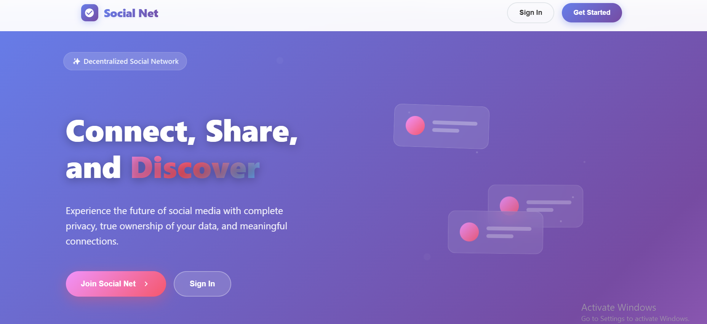
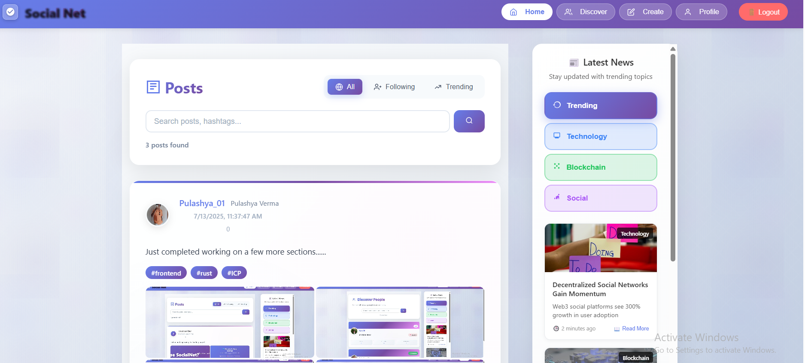
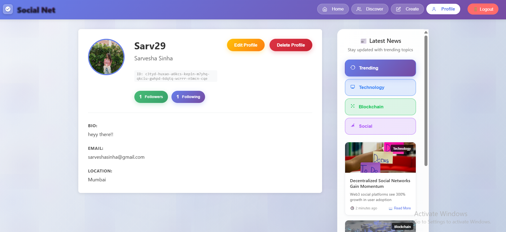
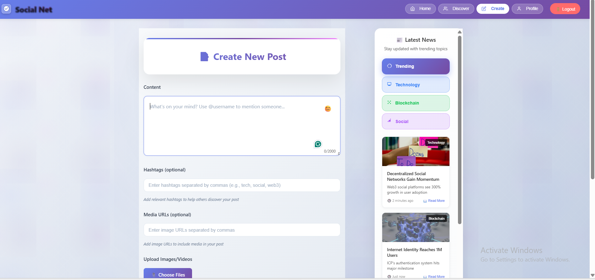
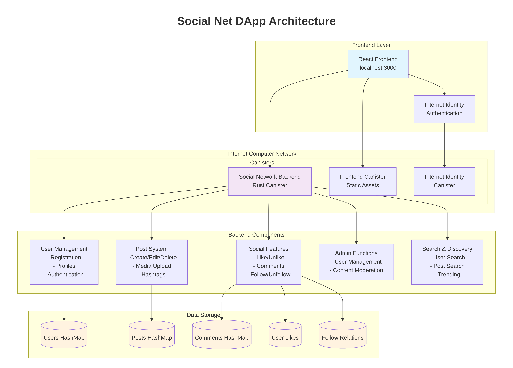

# Social Net - Decentralized Social Media Platform

[](https://internetcomputer.org/)
[](https://reactjs.org/)
[](https://www.rust-lang.org/)

> A fully decentralized social media platform built on the Internet Computer Protocol (ICP), featuring real-time interactions, multimedia support, and complete user data ownership.

##  Project Preview

### Landing Page

*The main landing page featuring the Social Net branding with animated feature highlights, login/signup options, and modern gradient design.*

### Main Feed

*The primary feed interface displaying posts from all users with like, comment, and share functionality.*

### Profile Management

*User profile management interface showing profile details, edit capabilities, and follower/following counts.*

### Post Creation

*Post creation interface with rich text editor, hashtag support, media upload functionality, and emoji picker*


##  Features

###  **Authentication & Security**
- **Internet Identity Integration** - Secure, passwordless authentication
- **Decentralized Identity** - Users own their identity and data
- **Privacy-First** - No corporate surveillance or data mining

###  **Social Features**
- **User Profiles** - Customizable profiles with bio, location, and profile pictures
- **Posts & Content** - Rich text posts with hashtag and mention support
- **Comments System** - Threaded discussions on posts
- **Like & Share** - Engage with content through likes and shares
- **Follow System** - Build your social network by following users

###  **Modern UI/UX**
- **Responsive Design** - Works seamlessly on desktop and mobile
- **Real-time Updates** - Live feed updates and notifications
- **Emoji Picker** - Express yourself with a comprehensive emoji selector
- **Media Support** - Upload and share images and videos
- **Search & Discovery** - Find users and content easily

###  **Admin Features**
- **User Management** - Admin dashboard for platform moderation
- **Content Moderation** - Tools for maintaining community standards
- **Analytics** - Platform statistics and user insights

##  Architecture


*Decentralized architecture built on Internet Computer Protocol*

### Frontend (React + Vite)
- **React 18** with modern hooks and context
- **Vite** for fast development and building
- **SCSS** for advanced styling with gradients and animations
- **Internet Identity** for authentication

### Backend (Rust + ICP)
- **Rust Canister** for high-performance backend logic
- **Internet Computer** for decentralized hosting
- **Candid Interface** for type-safe frontend-backend communication
- **Stable Memory** for persistent data storage

## Tech Stack

| Component | Technology |
|-----------|------------|
| **Frontend** | React, Vite, SCSS, JavaScript |
| **Backend** | Rust, Internet Computer Protocol |
| **Authentication** | Internet Identity |
| **Styling** | SCSS with CSS Grid/Flexbox |
| **State Management** | React Context + Hooks |
| **Build Tool** | DFX (DFINITY SDK) |

## Installation & Setup

### Prerequisites
- [Node.js](https://nodejs.org/) (v16 or higher)
- [DFX](https://internetcomputer.org/docs/current/developer-docs/setup/install/) (DFINITY SDK)
- [Rust](https://rustup.rs/) (for backend development)

### 1. Clone the Repository
```bash
git clone https://github.com/yourusername/social-net.git
cd social-net
```

### 2. Install Dependencies
```bash
npm install
```

### 3. Start Local Internet Computer
```bash
dfx start --background
```

### 4. Deploy Canisters
```bash
dfx deploy
```

### 5. Start Development Server
```bash
npm start
```

The application will be available at `http://localhost:3000`

## Usage

### For Users
1. **Sign Up** - Create account using Internet Identity
2. **Complete Profile** - Add your details, bio, and profile picture
3. **Explore** - Discover other users and their content
4. **Post** - Share your thoughts with text, images, or videos
5. **Engage** - Like, comment, and share posts from your network

### For Developers
1. **Backend Development** - Modify Rust code in `src/social_network_backend/`
2. **Frontend Development** - Edit React components in `src/social_network_frontend/`
3. **Styling** - Update SCSS files for UI customization
4. **Deploy** - Use `dfx deploy` to update canisters

## Project Structure

```
social-net/
├── src/
│   ├── social_network_backend/          # Rust backend canister
│   │   ├── src/lib.rs                   # Main backend logic
│   │   └── social_network_backend.did   # Candid interface
│   └── social_network_frontend/         # React frontend
│       ├── src/
│       │   ├── components/              # React components
│       │   ├── index.scss               # Main styles
│       │   ├── main.jsx                 # App entry point
|       │   └── App.jsx                     
│       └── index.html
├── dfx.json                            # DFX configuration
├── package.json                        # Node.js dependencies
└── README.md                          # This file
```

## Key Components

### Backend Functions
- **User Management** - Create, update, delete users
- **Post System** - CRUD operations for posts
- **Social Features** - Likes, follows, comments
- **Admin Functions** - Platform moderation tools

### Frontend Components
- **Authentication** - Internet Identity integration
- **Feed** - Real-time post feed with infinite scroll
- **Profile** - User profile management
- **Discover** - User discovery and search
- **Admin Dashboard** - Platform administration

##  Configuration

### Environment Variables
Create a `.env` file in the root directory:
```env
DFX_NETWORK=local
CANISTER_ID_SOCIAL_NETWORK_BACKEND=your_backend_canister_id
CANISTER_ID_SOCIAL_NETWORK_FRONTEND=your_frontend_canister_id
```

### DFX Configuration
The `dfx.json` file contains canister configurations for both local and IC network deployment.

## 🚀 Deployment

### Local Deployment
```bash
dfx deploy --network local
```

### IC Mainnet Deployment
```bash
dfx deploy --network ic --with-cycles 1000000000000
```

## Contributing

We welcome contributions! Please follow these steps:

1. Fork the repository
2. Create a feature branch (`git checkout -b feature/amazing-feature`)
3. Commit your changes (`git commit -m 'Add amazing feature'`)
4. Push to the branch (`git push origin feature/amazing-feature`)
5. Open a Pull Request


##  Acknowledgments

- [DFINITY Foundation](https://dfinity.org/) for the Internet Computer Protocol
- [Internet Identity](https://identity.ic0.app/) for secure authentication
- The ICP developer community for inspiration and support

##  Contact

- **Developer**: Sarvesha Sinha
- **Email**: sarveshasinha@gmail.com
- **LinkedIn**: [Your LinkedIn](https://linkedin.com/in/yourusername)

---

<div align="center">
  <strong>Built on the Internet Computer</strong>
</div>
